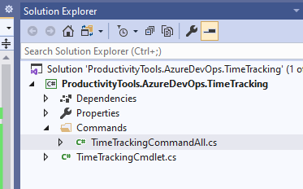

<!--Category:C#,PowerShell--> 
 <p align="right">
    <a href="https://www.nuget.org/packages/ProductivityTools.PSCmdlet/"></a>
    <a href="http://productivitytools.tech/pscmdlet/"><a> 
    <a href="https://www.github.com/pwujczyk/ProductivityTools.PSCmdlet"></a>
</p>
<p align="center">
    <a href="http://http://productivitytools.tech/">
        
    </a>
</p>

# PSCmdlet

It is base class for PowerShell Cmdlets. It provides structure of the commands and helps to write modular and clean.
<!--more-->

When starting Cmdlet at first code is nice and clean one method which make one thing. Next new switches starts to appear and code become messy. The main idea of PSCmdlet is to split functionality into many functions which can decide if they should execute or not.


## Quick Start

### Create Cmdlet class

 - Create new .NET Standard library
 - Add reference to **ProductivityTools.PSCmdlet**
 - Deliver from from **PSCmdlet.PSCmdletPT**
 - Add CmdletAttribute with module command **[Cmdlet(VerbsCommon.Get, "AssignedItems")]**

 Class name is not important. Value in the **Cmdlet** attribute will be used to invoke module from PowerShell (in our case Get-AssignedItems)

````c#
[Cmdlet(VerbsCommon.Get, "AssignedItems")]
public class TimeTrackingCmdlet :PSCmdlet.PSCmdletPT
{

}
````

### Generate ProcessRecord override

Generate ProcessRecord override. This method called when we are invoking the Cmdlet

 

Now you could write ``Console.Write("Hello")`` in this method and run it. To do it check **Debug** section.
 
```c#
    [Cmdlet(VerbsCommon.Get, "AssignedItems")]
    public class TimeTrackingCmdlet : PSCmdlet.PSCmdletPT
    {
        protected override void ProcessRecord()
        {
            Console.WriteLine("Hello");
            base.ProcessRecord();
        }
    }
```

### Create commands

Next step is creating commands. The best way to have it organized is to create new Commands directory and put all command there. 



Each command should deliver from **PSCmdlet.PSCommandPT<T>**. Generic T should be type of Cmdlet so in described case: **TimeTrackingCmdlet**. Additionally command should implement abstract PSCmdletPT abstract methods.

- **Condition** tell us if command should be executed, lets start with ``true``. 
- **Invoke** is main body of command, for now lets write something on the screen.

```c#
    public class TimeTrackingCommandAll : PSCmdlet.PSCommandPT<TimeTrackingCmdlet>
    {
        public TimeTrackingCommandAll(TimeTrackingCmdlet cmdletType) : base(cmdletType)
        {
        }

        protected override bool Condition => true;

        protected override void Invoke()
        {
            Console.WriteLine("Hello from TimeTrackingCommandAll");
        }
    }
 ```

 Next commands should be used in PSCmdlet and use it:

```c#
    [Cmdlet(VerbsCommon.Get, "AssignedItems")]
    public class TimeTrackingCmdlet : PSCmdlet.PSCmdletPT
    {
        public TimeTrackingCmdlet()
        {
            base.AddCommand(new TimeTrackingCommandAll(this));
        }

        protected override void ProcessRecord()
        {
            Console.WriteLine("Hello");
            base.ProcessCommands();
            base.ProcessRecord();
        }
    }

```

If you would like to check how it is working check **debug** section.

## More advanced conditions
If we would like to run command only when chosen parameters will be provided we should reflect it in the Condition property.

First add parameter to the Cmdlet:

```c#
    [Cmdlet(VerbsCommon.Get, "AssignedItems")]
    public class TimeTrackingCmdlet : PSCmdlet.PSCmdletPT
    {
        public string Name { get; set; }

        public TimeTrackingCmdlet()
        {
            base.AddCommand(new TimeTrackingCommandAll(this));
        }

        protected override void ProcessRecord()
        {
            base.ProcessCommands();
            base.ProcessRecord();
        }
    }
```

And next use it in the command:

```c#
    public class TimeTrackingCommandAll : PSCmdlet.PSCommandPT<TimeTrackingCmdlet>
    {
        public TimeTrackingCommandAll(TimeTrackingCmdlet cmdletType) : base(cmdletType)
        {
        }

        protected override bool Condition => string.IsNullOrEmpty(base.Cmdlet.Name);

        protected override void Invoke()
        {
            Console.WriteLine("Hello from TimeTrackingCommandAll");
        }
    }
```


## Help
Module by default adds Help parameter which displays on the screen description of the cmdlet and **HelpMessage** from the parameters.

```c#
    [Cmdlet(VerbsCommon.Get, "AssignedItems")]
    [Description("This is module used to help track time")]
    public class TimeTrackingCmdlet : PSCmdlet.PSCmdletPT
    {
        [Parameter(HelpMessage = "This is name")]
        public string Name { get; set; }

        public TimeTrackingCmdlet()
        {
            base.AddCommand(new TimeTrackingCommandAll(this));
        }

        protected override void ProcessRecord()
        {
            base.ProcessCommands();
            base.ProcessRecord();
        }
    }
```

Invoke module with **Help** switch


## Debugging

VS by default doesn't copy the referenced packages to bin directory, but we need them to be able to debug application. To make it possible add ``CopyLocalLockFileAssemblies`` node to the project csproj file.

```
<Project Sdk="Microsoft.NET.Sdk">

  <PropertyGroup>
    <TargetFramework>netstandard2.0</TargetFramework>
    <UserSecretsId>4dbd570d-5934-4d10-8bee-114f59f3a0a9</UserSecretsId>
    <CopyLocalLockFileAssemblies>true</CopyLocalLockFileAssemblies>
  </PropertyGroup>

  <ItemGroup>
    <PackageReference Include="ProductivityTools.PSCmdlet" Version="1.0.1" />
  </ItemGroup>
</Project>

```
Next in the debug window add PowerShell path to be run when debbuging.

```
C:\Program Files\PowerShell\7\pwsh.exe
```
Or if you using .NETFramework ``C:\Windows\System32\WindowsPowerShell\v1.0\powershell.exe``

And for the command line parameters something similar to:

```
-noexit -command "-noexit -command "import-module D:\GitHub\ProductivityTools.AzureDevOps.TimeTracking\ProductivityTools.AzureDevOps.TimeTracking\bin\Debug\netstandard2.0\ProductivityTools.AzureDevOps.TimeTracking.dll"
```


Then after running project using F5, new PowerShell window will show up, thanks to application arguments, module will be imported and you will be able to use the command defined in ``cmdlet`` attribute.

This of course need from you make ``dotnet publish`` always before debugging. 

